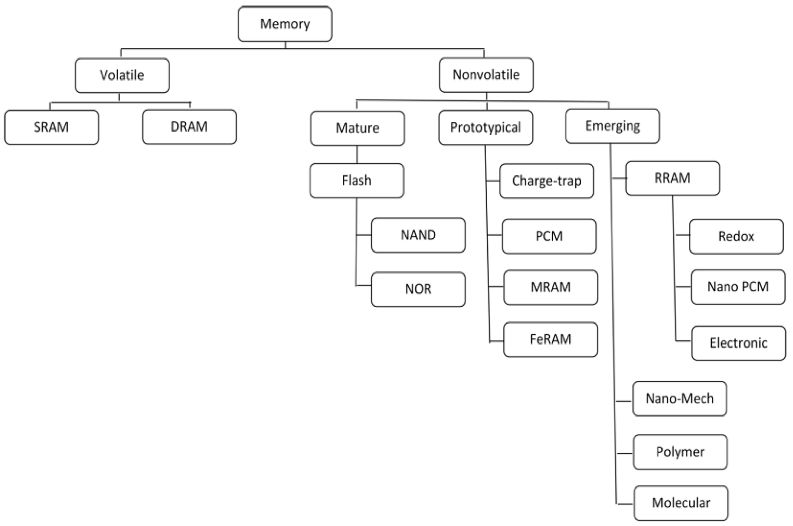
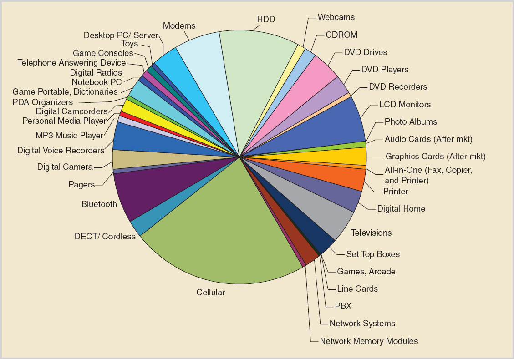
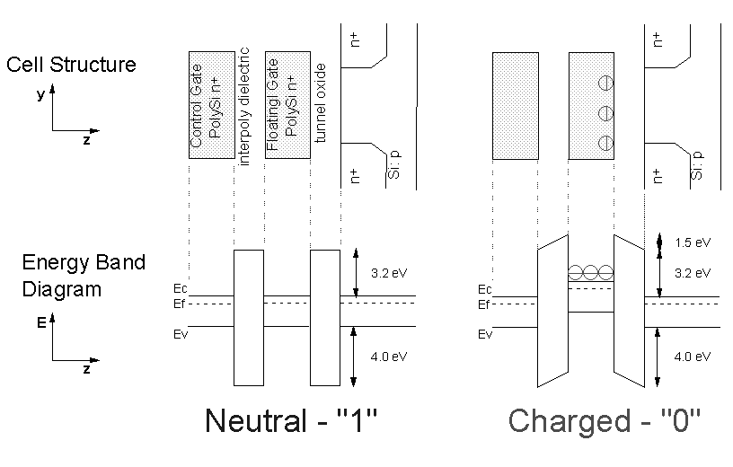
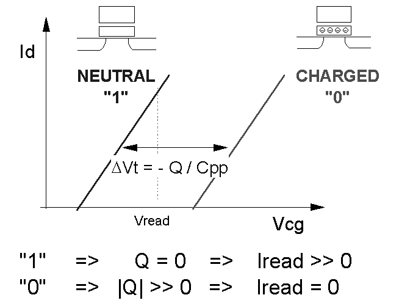

Introduction

## Flash technology overview

### memory hierarchy:

The development of memory technology has long been a main force driving the semiconductor industry at a fast pace following Moore's law, and its growth is expected to continue with more innovative technology solutions. In terms of whether they can store data without power supply, the types of memory can be categorized mainly as 2 branches(see Fig.1):


* volatile memory: Typical devices are SRAM and DRAM. Although it dominates a number of very important applications including computer main memory and cache, due to its very fast read/write speed, it must require consistent power to keep the data stored, which is the reason that it's called volatile.
* non-volatile memory: Typical devices are EPROM and Flash. Non-volatility, satisfactory performance, density and cost per bit, these distinct characteristics of non-volatile memory, in particular flash, make it the underlying technology of most storage devices and applications, ranging from memories within mobile phone, camera, embedded systems, to Solid-State Drive as large as 400 GB. (see Fig.2.)

### Flash:

#### Flash history:

The original concept was presented in 1971 by Frohman-Bentchkowsky, who suggested a MOS transistor structure with a floating gate, that stores charge by avalanche injection\[1,2\]. Then the erasable programmable read only memory(EEPROM) utilized that concept, and was once a dominant technology for nonvolatile memory. Flash memory derives from EEPROM, a major difference being that EEPROM uses ultraviolet(UV) to erase, whereas flash makes it possible to electrically erase data. 
Started from 1990s, flash has been increasingly growing both in the maturity of technology and its market share. The feature size scaled from um order of magnitude down to the current state-of-art of 20nm. 
Before 2000, flash was more of a EPROM replacement, with only less than 2Mb volume of storage, and read/write cycle was limited to 10000 times.
Since 2000, flash became widely used in memory market and numerous researches are focused on structure and reliability issues that may hinder further scaling down of flash memory. 
The trend of reinventing or even substituting flash in order to improve the life time, reliability and performance of nonvolatile memory starts in recent years, with help of emerging technologies including 3D integrated circuit, for making a 3D flash structure, and alternative nonvolatile memory concepts, such as phase change memory.\[5\]

#### Flash structure:

Most of flash technologies are based on the floating-gate structure initially introduced in 1971. A flash cell is essentially a MOS transistor with floating-gate. The floating-gate is a insulate polysilicon layer between the control gate and the transistor channel, as shown in Fig.3. 

The material between the control gate and the floating gate is oxide-nitride-oxide(ONO), and an oxide called "tunnel oxide" forms a tunnel possible for electron to go through(under certain circumstances, i.e., Channel Hot Electron:CHE) is between the floating-gate and the transistor channel. The floating-gate is effectively isolated by both of these two layers, acting as a charge-trapping element able to store information ideally permanently without power supply. The tunnel oxide is critical since it is the path through which electrons are transported by electrical pulses during programing and erasing, so we will later discuss several reliability issues that emphasize on the tunnel oxide, and possible damages that could occur.

The cell has 2 states to represent one bit:

When the charge stored in the floating-gate is neutral, it is considered as a logic "1". And when a negative amount of charge is stored, it represents logic "0". As shown in Fig.4.

#### Flash operation:

##### Reading:

Reading operation is accomplished by applying a reading voltage on the control gate, and measuring the threshold voltage of the MOS transistor. As depicted in Fig.5, the threshold voltages for  logic "1" and "0" differ by an amount of voltage shift due to the charge state in the floating-gate. In the case of logic "0" condition, the negative charge stored counteract the voltage applied on the gate, demanding it to increase the voltage to generate a current between source and drain. Selecting a proper threshold voltage(Vt) makes it possible to determine the charge state in the floating-gate, thus the logic value. If there's no current flow when applying Vt, it suggests a "0", and an "1" otherwise.

##### Writing:

###### Programming:

###### Erasing:

## Flash limitations/reliability:

## Methods to improve reliability:

## References
1. D. Frohman-Bentchkowsky, “Memory behavior in a floating-gate avalanche-injection MOS (FAMOS) structure,” Appl. Phys. Lett., vol. 18, pp. 332–334, 1971.
2. “FAMOS – A new semiconductor charge storage device,” Solid State Electron., vol. 17, pp. 517–520, 1974.
3. S. Mukherjee, T. Chang, R. Pang, M. Knecht, and D. Hu, “A single transistor EEPROM cell and its implementation in a 512 K CMOS EEPROM,” in IEDM Tech. Dig., 1985, pp. 616–619.
4. Roberto Bez, Emilio Camerlenghi, Alberto Modelli, and Angelo Visconti,"Introduction to Flash Memory," Proceedings of the IEEE  vol.91, Issue 4, 2003
5. CHIH-YUAN LU,"Nonvolatile Memory Technology: A Driver to Future Nanoelectronics," World Scientific,Vol. 2, Issue 1, March 2012
6. 
